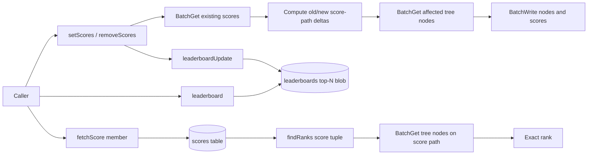

# Ranker

`@0xflicker/ranker` is a serverless DynamoDB leaderboard library. It stores scores in DynamoDB, keeps a bounded top-N leaderboard, and uses a branching count tree to resolve ranks without scanning every member.

## Problem

DynamoDB can sort efficiently within a partition and index, but it does not provide an efficient native query for "what is this member's global rank?" across an arbitrary score range. A plain top-N table is easy; rank lookup for every member is the hard part.

## Solution

Ranker stores each member score separately and maintains a score-range tree in DynamoDB. Each tree node stores child counts. To update a score, the library subtracts the old score path, adds the new score path, and writes the affected nodes and score record in DynamoDB batches. To resolve rank, it walks the score path and sums counts in higher-scoring sibling buckets.

A separate `leaderboards` table stores the tracked top-N list as a JSON blob. That makes top-N reads simple, while the ranking tree remains the source for arbitrary score/rank resolution.

## Guarantees and Tradeoffs

- **Exact rank for score values:** `findRanks(scores)` returns exact ranks for score tuples represented in the configured discrete score ranges.
- **Rank lookup for any member:** fetch the member score from `scores`, then resolve its rank through the tree.
- **Rank-to-score lookup:** `findScore(rank)` returns the score tuple at a rank and the count at that score. It does not return a member id.
- **Top-N tracking:** `leaderboardSize` bounds the stored leaderboard list; omitted size tracks all known scores.
- **Bounded tree work:** update and lookup work are bounded by score dimensions, score-range width, and `branchingFactor`, not by total leaderboard population.
- **Multi-field tie breakers:** score tuples such as `[primaryScore, tieBreaker]` are supported through paired score ranges.
- **Freshness and consistency:** score and node writes use DynamoDB batch writes, not a transaction. A failed or partially retried write can leave temporary inconsistency unless the caller retries and reconciles.
- **Write amplification:** each score update touches the path for the old score and the path for the new score, plus the score row and leaderboard blob when used.
- **Contention:** hot leaderboards update shared tree nodes near the root and a shared top-N blob.

## Data Model

| Table | Key fields in code | Purpose |
|---|---|---|
| `boards` | `Name` | Leaderboard configuration: score range, branching factor, leaderboard size, period, display name, and description. |
| `scores` | `Board_Name`, `Player_ID` | Per-member score tuple and timestamp. |
| `nodes` | `Board_Name`, `Node_ID` | Ranking tree nodes. Each node stores `Child_Counts`, one count per branch. |
| `leaderboards` | `Board_Name`, `Period` | Stored top-N score list for quick leaderboard reads. |

Table names default to `boards`, `scores`, `nodes`, and `leaderboards`, and can be overridden with `TABLE_NAME_RANKER_*` environment variables or the exported `config`.

## Data Flow



## Operations

| Operation | Guarantee | Reads | Writes | Complexity / bound | Notes |
|---|---|---:|---:|---|---|
| Insert or update score | Updates the member score and score-count tree for the old/new score paths. | Batch get existing score; batch get affected nodes. | Batch write affected nodes and score row. | Bounded by `findNodeIds(score)` for old and new scores. | Batch writes are not transactional. |
| Remove score | Removes member score and decrements that score path. | Batch get scores to remove; batch get affected nodes. | Batch write affected nodes and score deletes. | Bounded by removed score paths. | Returns removed score records so callers can update top-N. |
| Read top N | Returns the stored leaderboard list. | One get from `leaderboards`. | 0 | O(1) table read plus returned list size. | Top-N list is maintained separately from the ranking tree. |
| Resolve exact rank | Returns exact rank for configured discrete score tuple. | Batch get nodes along score path. | 0 | Bounded by score dimensions and range subdivision. | Higher scores rank first; ties share the same score position count semantics in the tree. |
| Resolve rank-to-score | Returns score tuple and count at rank. | Recursive node reads. | 0 | Bounded by tree depth and branch traversal. | Does not identify a specific member. |

## Installation

```bash
echo "@0xflicker:registry=https://npm.pkg.github.com" >> .npmrc
npm install @0xflicker/ranker
```

## Usage

```ts
import { DynamoDBClient } from "@aws-sdk/client-dynamodb";
import { DynamoDBDocumentClient } from "@aws-sdk/lib-dynamodb";
import { createRanker, initRanker } from "@0xflicker/ranker";

const db = DynamoDBDocumentClient.from(new DynamoDBClient(), {
  marshallOptions: { convertEmptyValues: true },
});

await createRanker({
  db,
  rootKey: "contest",
  scoreRange: [0, 1_000_000],
  branchingFactor: 100,
  leaderboardSize: 100,
});

const ranker = await initRanker({ db, rootKey: "contest" });

const [input, output] = await ranker.setScores([
  { playerId: "alice", score: [900] },
  { playerId: "bob", score: [750] },
]);

await ranker.leaderboardUpdate(input, output);

const bob = await ranker.fetchScore("bob");
const [bobRank] = bob ? await ranker.findRanks([bob.Score]) : [null];
```

## Concurrency and Failure Semantics

The implementation uses DynamoDB `BatchGet` and `BatchWrite`. It does not use conditional writes or DynamoDB transactions for node-count updates. That keeps the API simple, but callers should treat updates as retryable operations and be careful with high-contention boards where many writers update the same tree paths or top-N blob.

Expired score cleanup exists through `expireScores()`, using the configured `period` and stored score timestamps.

## Known Limits

- The top-N leaderboard is stored as one list, so very large `leaderboardSize` values make the blob less attractive.
- Root and high-level tree nodes can become hot for very active boards.
- No benchmark harness is currently checked in, so this README intentionally avoids latency, throughput, cost, or "high-performance" claims.
- The library depends on a caller-managed DynamoDB table setup; table definitions and IAM policies are outside this package.

## Benchmarks

No reproducible benchmark harness is currently included. A useful benchmark should record dataset size, score distribution, branching factor, DynamoDB mode/local-vs-AWS environment, request concurrency, p50/p95 latency, consumed capacity where available, and retry behavior.

## Attribution

Converted to TypeScript from [Ruberik/google-app-engine-ranklist](https://github.com/Ruberik/google-app-engine-ranklist), licensed Apache 2.0 with attribution.
